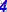
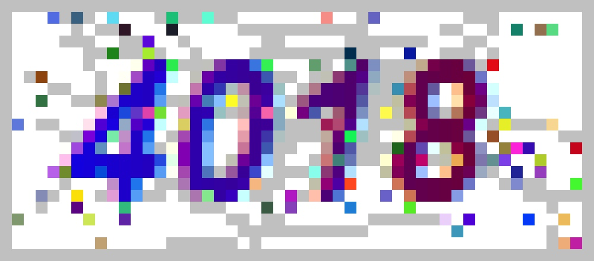

# Indroduction of Captch

## What is Captcha?
  * Captcha (English: Completely Automated Public Turing test to tell Computers and Humans Apart
    主要用途: 全自動區分電腦和人類的測試
  * How Captcha work ?
    Server create the picture which combine the distorted letter or image and send it to client side  
---
## Ours Goals
  **We want to predict the answer of Captcha and get over 95% correct percentage**

---

## Image Process

  * How we get sample: Download the Captcha image from website (https://course.fcu.edu.tw/validateCode.aspx

  * Captcha description: 
    The Captcha is maked up with 4 number which is random choosed from number 0-9.
    Image size: (22, 50)
    
  * Count of Captcha: 10000

---
  原圖形大小為(22, 50), 這邊為了方便閱讀將圖片大小放大為原圖的4倍。
   
  將圖片轉成(22, 50)的矩陣
  * 
 

